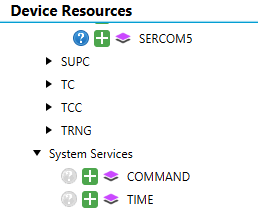
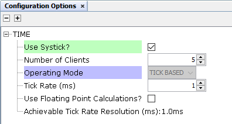
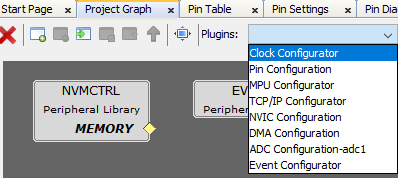
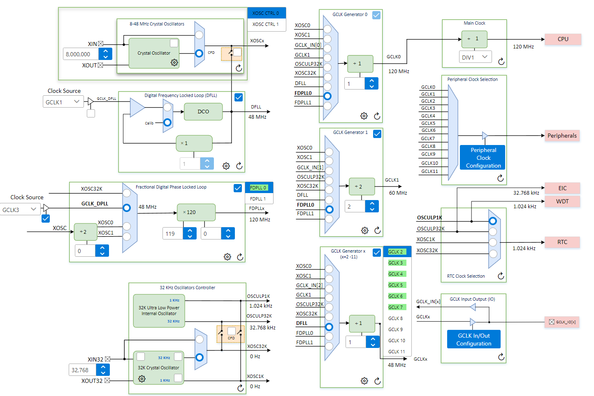
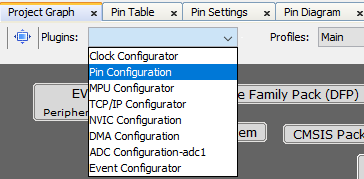
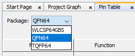

# 🛠️ Tutorial: Cómo usar MPLAB

## Recursos oficiales
🔗 [Datasheet SAM D5x/E5x Family](https://ww1.microchip.com/downloads/aemDocuments/documents/MCU32/ProductDocuments/DataSheets/SAM-D5x-E5x-Family-Data-Sheet-DS60001507.pdf)

🔗 [Tutoriales oficiales de Microchip Technology](https://mu.microchip.com/page/embedded-system-design)

🔗 [Periféricos para SAM y PIC32 (Deep Dive)](https://mu.microchip.com/sam-and-pic32-peripheral-deep-dive)

---

## 🚀 Creación de un nuevo proyecto

Recomiendo seguir este tutorial como primer paso:

🔗 [Crear tu primer proyecto Harmony 3](https://microchip-mplab-harmony.github.io/quick_docs/source/basic/create_first_harmony_3_project/readme.html)

### Videos recomendados para ATSAM

- [Introducción a Harmony 3 (YouTube)](https://www.youtube.com/watch?v=mL8Ge7LzGkA)
- [Configuración básica de Harmony 3 (YouTube)](https://www.youtube.com/watch?v=9MvtTYReosY)

---

## ⚙️ Configuración de periféricos AVM

### Systick
Para generar delays, es buena idea tener el systick habilitado, para esto en device resources se busca:
```
Libraries → Harmony → System Services → TIME
```
<div align="center">
	
</div>

En TMR, dando clic derecho se puede agregar el satisfacer RTC en caso de no tenerlo agregado, luego, haciendo clic en el bloque TIME, se puede agregar systick y su ratio:

<div align="center">
	
</div>

---

Una vez activado y configurado, al generar código puedes utilizar funciones como:

```c
void SYSTICK_TimerInitialize(void);
void SYSTICK_TimerRestart(void);
void SYSTICK_TimerStart(void);
void SYSTICK_TimerStop(void);
void SYSTICK_TimerPeriodSet(uint32_t period);
uint32_t SYSTICK_TimerPeriodGet(void);
uint32_t SYSTICK_TimerCounterGet(void);
uint32_t SYSTICK_TimerFrequencyGet(void);
void SYSTICK_DelayMs(uint32_t delay_ms);
void SYSTICK_DelayUs(uint32_t delay_us);
```

Estas funciones están disponibles en:

```
src/config/default/peripheral/port/systick/plib_systick.h
```


### ⏰ Configuración de relojes

Al abrir el plugin **Clock Configurator** en el MCC:

<div align="center">
	
</div>

Se abre una interfaz como la siguiente:

<div align="center">
	
</div>

De esta ventana destaca la sección **GCLK Generator x**, que permite crear hasta 10 relojes independientes entre sí, pero solo siendo un divisor entero de los de origen. En la sección **Peripheral Clock** se debe asignar a cada periférico un reloj de los generados.

> ⚠️ **Nota:** Intenté crear un FDPLL 1 pero el MCU no arrancaba después de eso.

---

### 🖲️ Configuración de pines

Abre el plugin **Pin Configuration** en el MCC, como se muestra:

<div align="center">
	
</div>

Se recomienda, en primera instancia, cambiar el paquete:

<div align="center">
	
</div>

---

## 📚 Periféricos utilizados en el AVM

- [Configuración de GPIO](./assets/GPIO.md)
- [Configuración de Timers](./assets/Timers.md)
- [Configuración de I2C](./assets/I2C.md)
- [Configuración de SPI](./assets/SPI.md)
- [Configuración de USB CDC](./assets/usb_cdc.md)
