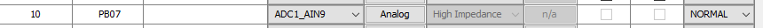
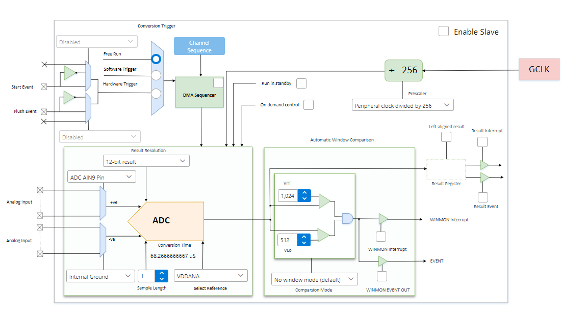

# Configuración de ADC

## 1. Introducción

> ℹ️ **Nota:**  
> El AVM mide batería por PMIC, pero dejo esta guía por si acaso.

---

## 2. Agregar instancia de ADC

En el **Project Graph**, agrega una instancia de ADC desde:

```
Libraries → Harmony → Peripherals → ADC → ADCx
```

---

## 3. Configuración del bloque ADC

- Elige el **pin** a utilizar.
- Configura los requerimientos de conversión necesarios.

<div align="center">
	
</div>

---

## 4. Configuración del Pin

Configura el pin como **ADC** en *Pin Settings*:

<div align="center">
	
</div>

---

## 5. Asignación de Reloj

Asegúrate de asignar un reloj en **Peripheral Clock Configuration**:

<div align="center">
	
</div>

---

## 6. Uso en el Código

Al generar código, se crean los archivos en:

```
src/config/default/peripheral/adc/
```

En ellos encontrarás las funciones necesarias para leer del ADC.

| Función                       | Descripción                        |
|-------------------------------|------------------------------------|
| `ADC1_Enable()`               | Habilita el ADC                    |
| `ADC1_ConversionStart()`      | Inicia la conversión               |
| `ADC1_ConversionStatusGet()`  | Consulta si la conversión terminó  |
| `ADC1_ConversionResultGet()`  | Obtiene el resultado               |

**Ejemplo de uso:**

```c
// Antes del while
ADC1_Enable();

// En el while
ADC1_ConversionStart();
// Espera bloqueante
ADC1_ConversionStatusGet();

// Leer el valor
ADC1_ConversionResultGet();
```

---

## 7. Configuración avanzada

Para configuraciones más sofisticadas, existe un plugin de **ADC Configuration**:

<div align="center">
	
</div>

---

[⬅️ Volver al README](./../README.md)