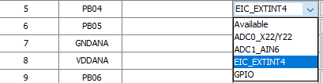
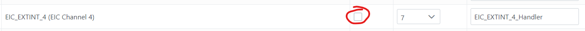

# Configuración de GPIO

## 1. Selección de Pines

Una vez en los **Pin Settings**, selecciona un pin como **GPIO** (entrada/salida) o como **interrupción**:

<div align="center">
	
</div>

---

## 2. Pines GPIO

> ⚡ **Nota:** Para los pines **GPIO** no se requiere mayor configuración.

Al generar el código, las macros correspondientes aparecerán en el archivo:

```
src/config/default/peripheral/port/plib_port.h
```

Estas macros permiten leer o escribir en el GPIO según el nombre asignado.

| Pin   | Macros para Escribir                        | Macro para Leer   | Macros para Configurar           |
|-------|---------------------------------------------|-------------------|----------------------------------|
| LED_R | `LED_R_Set()`<br>`LED_R_Clear()`<br>`LED_R_Toggle()` | `LED_R_Get()`     | `LED_R_OutputEnable()`<br>`LED_R_InputEnable()` |
| BTN_1 | -                                           | `BTN_1_Get()`     | -                                |

```c
// --- Macros para el pin LED_R ---
#define LED_R_Set()               (PORT_REGS->GROUP[1].PORT_OUTSET = ((uint32_t)1U << 8U))
#define LED_R_Clear()             (PORT_REGS->GROUP[1].PORT_OUTCLR = ((uint32_t)1U << 8U))
#define LED_R_Toggle()            (PORT_REGS->GROUP[1].PORT_OUTTGL = ((uint32_t)1U << 8U))
#define LED_R_OutputEnable()      (PORT_REGS->GROUP[1].PORT_DIRSET = ((uint32_t)1U << 8U))
#define LED_R_InputEnable()       (PORT_REGS->GROUP[1].PORT_DIRCLR = ((uint32_t)1U << 8U))
#define LED_R_Get()               (((PORT_REGS->GROUP[1].PORT_IN >> 8U)) & 0x01U)
#define LED_R_PIN                 PORT_PIN_PB08

// --- Macros para el pin BTN_1 ---
#define BTN_1_Get()               (((PORT_REGS->GROUP[0].PORT_IN >> 5U)) & 0x01U)
#define BTN_1_PIN                 PORT_PIN_PA05
```

---

## 3. Pines con Interrupción (EIC)

Para crear **interrupciones**:

1. **Define el pin como EIC** desde el plugin *Pin Configuration*:

<div align="center">
	
</div>

2. **Configura el NVIC** en el plugin *NVIC configuration*:

<div align="center">
	
</div>

3. **Activa la línea de interrupción** correspondiente al pin:

<div align="center">
	
</div>

- Marca el *Check* para habilitar.
- Asigna prioridad.
- (Opcional) Cambia el nombre del handler.

---

> ⚠️ **Importante:**  
> Los siguientes pasos deben poder hacerse de forma más fácil, pero no encontré la opción en MPLAB.

Según el capítulo 23 del [datasheet](https://ww1.microchip.com/downloads/aemDocuments/documents/MCU32/ProductDocuments/DataSheets/SAM-D5x-E5x-Family-Data-Sheet-DS60001507.pdf), para configurar la interrupción se manipula el registro `EIC_REGS`.  
El siguiente código (presente en [button.c](./../src/button.c)) proporciona un ejemplo:

```c
void BTN_InterruptInit(void) // llamar una vez al principio del código
{
    // Configurar pines con interrupción por flanco de bajada solamente
    EIC_REGS->EIC_CONFIG[0] = (EIC_REGS->EIC_CONFIG[0] & ~(0x7 << (5 * 4))) | (0x2 << (5 * 4)); // SENSE5 = falling edge
    EIC_REGS->EIC_INTFLAG = (1 << 5);  // Limpia banderas
    EIC_REGS->EIC_INTENSET = (1 << 5);  // Habilita interrupciones
    EIC_REGS->EIC_CTRLA |= EIC_CTRLA_CKSEL_Msk;  // Usa el reloj CLK_ULP32K para el EIC
    EIC_REGS->EIC_CTRLA |= EIC_CTRLA_ENABLE_Msk; // Habilita el EIC
}
```

- En el ejemplo anterior se configura el pin **PA5** para interrupción por flanco de bajada.
- Se debe habilitar el EIC **después** de configurar todas las interrupciones del proyecto, de lo contrario, las posteriores no funcionarán.

En el *handler*, se debe limpiar la bandera:

```c
void EIC_EXTINT_5_Handler(void)
{
    EIC_REGS->EIC_INTFLAG = (1 << 5);
    // Resto del código
}
```

---

[⬅️ Volver al README](./../README.md)