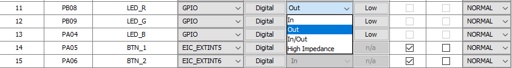

# Configuración de Pines GPIO

Una vez en los **Pin Settings**, selecciona un pin como GPIO (entrada/salida) o como interrupción:

<div align="center">
	
</div>

---

### Pines GPIO

Para los pines **GPIO** no se requiere mayor configuración. Al generar el código, las macros correspondientes aparecerán en el archivo:

```
src/config/default/peripheral/port/plib_port.h
```

Estas macros permiten leer o escribir en el GPIO según el nombre asignado. Por ejemplo:

```c
// --- Macros para el pin LED_R ---
#define LED_R_Set()               (PORT_REGS->GROUP[1].PORT_OUTSET = ((uint32_t)1U << 8U))
#define LED_R_Clear()             (PORT_REGS->GROUP[1].PORT_OUTCLR = ((uint32_t)1U << 8U))
#define LED_R_Toggle()            (PORT_REGS->GROUP[1].PORT_OUTTGL = ((uint32_t)1U << 8U))
#define LED_R_OutputEnable()      (PORT_REGS->GROUP[1].PORT_DIRSET = ((uint32_t)1U << 8U))
#define LED_R_InputEnable()       (PORT_REGS->GROUP[1].PORT_DIRCLR = ((uint32_t)1U << 8U))
#define LED_R_Get()               (((PORT_REGS->GROUP[1].PORT_IN >> 8U)) & 0x01U)
#define LED_R_PIN                 PORT_PIN_PB08

// --- Macros para el pin BTN_1 ---
#define BTN_1_Get()               (((PORT_REGS->GROUP[0].PORT_IN >> 5U)) & 0x01U)
#define BTN_1_PIN                 PORT_PIN_PA05
```

---

<!-- Continúa aquí con la sección de interrupciones si lo deseas -->