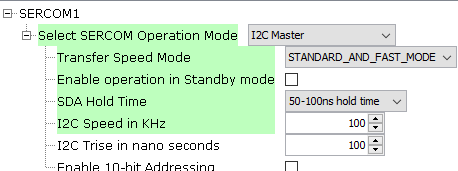
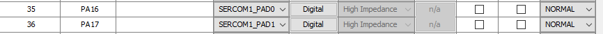
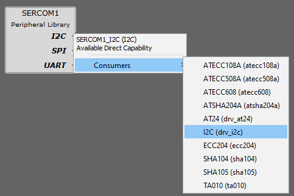

# Configuración de I2C (SERCOM)

## 1. Agregar el Periférico SERCOM

En la ventana **Device Resources**, busca el SERCOM correspondiente:

```
Libraries → Harmony → Peripherals → SERCOMx
```

> ℹ️ **Nota:**  
> Para saber qué SERCOM corresponde a los pines físicos, consulta el capítulo 6 del [datasheet](https://ww1.microchip.com/downloads/aemDocuments/documents/MCU32/ProductDocuments/DataSheets/SAM-D5x-E5x-Family-Data-Sheet-DS60001507.pdf).

---

## 2. Configuración del SERCOM como I2C

Una vez agregado el SERCOM, haz clic sobre él para abrir las **Configuration Options**.  
En el combobox **Select SERCOM operation mode**, selecciona **I2C Master** (no probado en modo slave).

<div align="center">
	
</div>

> ⚙️ **Nota:** Las configuraciones mostradas corresponden a valores estándar y pueden variar según el dispositivo esclavo.

---

## 3. Configuración de Pines

En el plugin **Pin Configurator**, busca los pines físicos y asígnales el SERCOM y su pad correspondiente:

<div align="center">
	
</div>

---

## 4. Configuración de Reloj

En el plugin **Clock Configurator**, busca la sección de **Peripheral Clock Configurator**, baja hasta llegar al SERCOM correspondiente y asegúrate que tenga reloj asignado.

<div align="center">
	
</div>

---

## 5. (Opcional) Agregar Driver

> ⚠️ **Advertencia:**  
> Se puede agregar el driver desde el *Project Graph*. En algunos casos funciona correctamente, pero en otros puede presentar problemas.

<div align="center">
	
</div>

---

## 6. Generación de Código y Funciones Disponibles

Al generar el código, se agregan las librerías de I2C en:

```
src/config/default/peripheral/sercom/i2c_master/
```

| Función                                 | Descripción                                 |
|------------------------------------------|---------------------------------------------|
| `SERCOM1_I2C_Initialize()`               | Inicializa el periférico I2C                |
| `SERCOM1_I2C_Read(...)`                  | Lee datos desde un esclavo I2C              |
| `SERCOM1_I2C_Write(...)`                 | Escribe datos a un esclavo I2C              |
| `SERCOM1_I2C_WriteRead(...)`             | Escribe y luego lee datos                   |
| `SERCOM1_I2C_IsBusy()`                   | Consulta si el bus está ocupado             |

> 📄 El archivo [codec.c](./../src/codec.c) contiene un ejemplo de uso del I2C.

---

[⬅️ Volver al README](./../README.md)