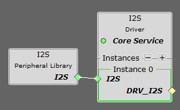
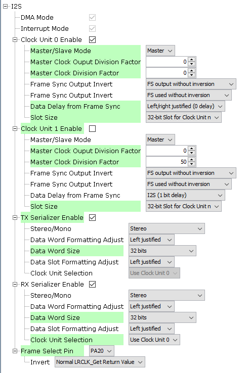
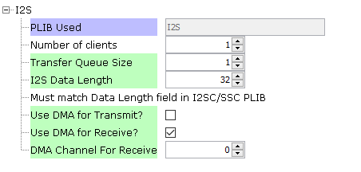
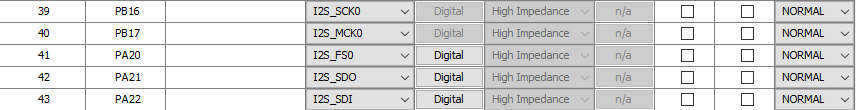
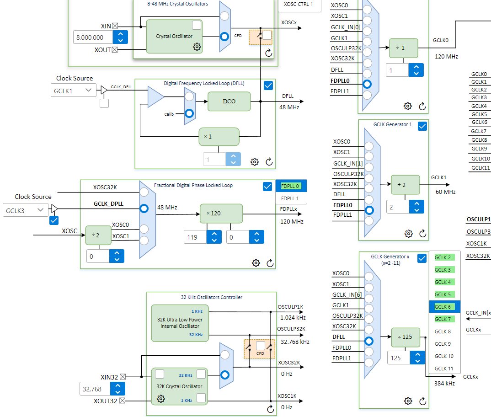
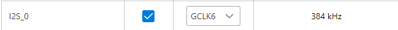
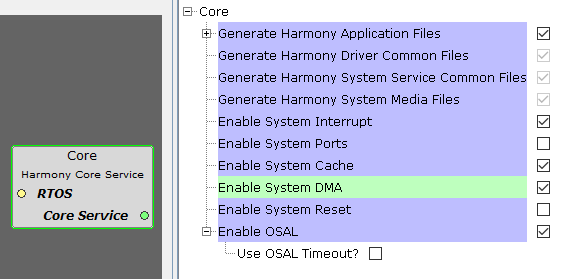
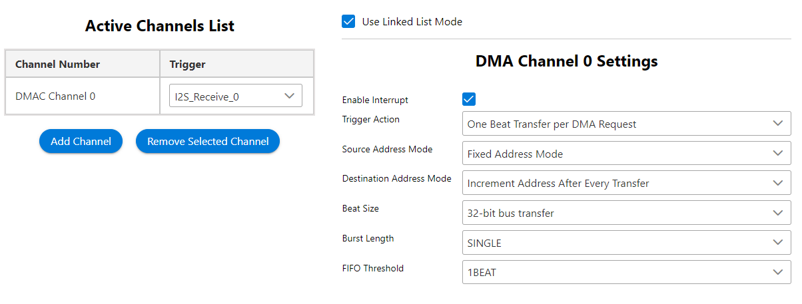

# Configuración de I2S con DMA

---

## 1. Agregar bloques necesarios

Agrega los siguientes bloques desde:

```
Libraries → Harmony → Audio → Drivers → I2S
```

<div align="center">
	
</div>

---

## 2. Configuración del I2S

Configuración funcional recomendada:

<div align="center">
	
</div>

> ℹ️ **Nota:**  
> Ignora la configuración del *clock unit 1*.  
> No se usó división de reloj, ya que se utiliza directamente un reloj de la frecuencia requerida.  
> El divisor no funcionó para frecuencias altas, por lo que solo se pudo dejar en **12 kHz**.

- Cambiar el *slot size* puede afectar el funcionamiento del DMA.

---

## 3. Configuración del Driver

<div align="center">
	
</div>

---

## 4. Asignación de Pines

Asigna los pines del I2S según corresponda:

<div align="center">
	
</div>

---

## 5. Configuración de Reloj

- Se configuró un **GCLK** a **384 kHz** dividiendo uno de **48 MHz** por **125**:

<div align="center">
	
</div>

> 32 bits * 12 kHz = 384 kHz

- Luego, asigna este reloj al periférico:

<div align="center">
	
</div>

---

## 6. Configuración del DMA

1. Habilita el DMA en el bloque **core**:

<div align="center">
	
</div>

2. En el plugin **DMA configuration**, crea el siguiente canal:

<div align="center">
	
</div>

---

## 7. Ajuste en el Código Generado

> ⚠️ **Importante:**  
> Al generar código, es necesario **comentar** las dos últimas líneas de la estructura del I2S y el DMA en:

```
src/config/default/initialization.c
```

```c
/* I2S Driver Initialization Data */
DRV_I2S_INIT drvI2S0InitData =
{
    /* I2S PLIB API */
    .i2sPlib = &drvI2S0PlibAPI,

    /* I2S IRQ */
    .interruptI2S = DRV_I2S_INT_SRC_IDX0,

    /* I2S Number of clients */
    .numClients = DRV_I2S_CLIENTS_NUMBER_IDX0,

    /* I2S Queue Size */
    .queueSize = DRV_I2S_QUEUE_SIZE_IDX0,  

    .dmaChannelTransmit = DRV_I2S_XMIT_DMA_CH_IDX0,
    .dmaChannelReceive  = DRV_I2S_RCV_DMA_CH_IDX0,
    .i2sTransmitAddress = (void *)&(I2S_REGS->I2S_TXDATA),
    .i2sReceiveAddress = (void *)&(I2S_REGS->I2S_RXDATA),

    /************ code specific to SAM E70 ********************/
   // .interruptDMA = DMAC_IRQn,
    /************ code specific to SAM E70 ********************/
   // .dmaDataLength = DRV_I2S_DATA_LENGTH_IDX0,
};
```

---

## 8. Uso de I2S con DMA

En el archivo [i2s_dma_manager.c](../src/i2s_dma_manager.c) se encuentran funciones para:

- Iniciar el DMA
- Crear dos buffers para el I2S
- Configurar el *ping-pong* de los buffers
- Dar la señal a la SD para que escriba

---

[⬅️ Volver al README](./../README.md)