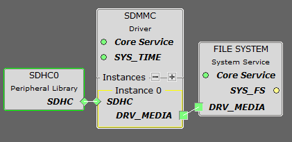
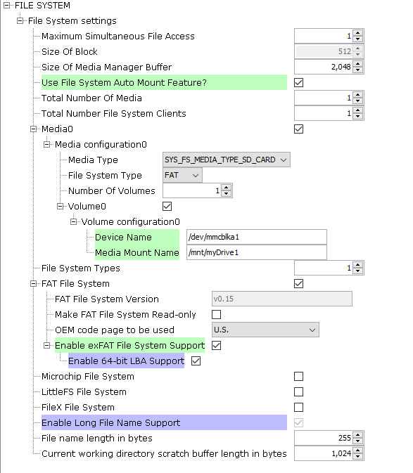
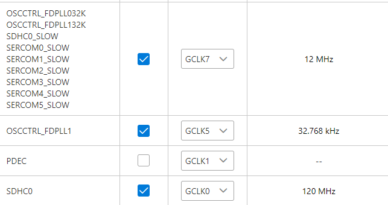
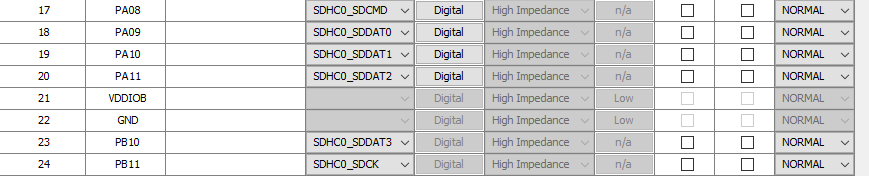
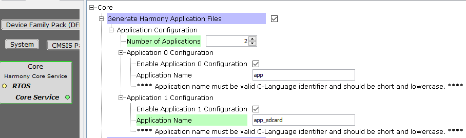

# Configuración de SD Card en el AVM

> 📝 **Nota:**  
> Por la naturaleza del AVM, el código de escritura en la SD está fuertemente enlazado al del I2S.  
> **Se recomienda configurar primero el [I2S](./I2S.md).**

---

## 🐐 Tutorial recomendado

Ver este tutorial, este viejo es el GOAT (🐐):

🔗 [Creating Advanced Embedded Applications with 32-bit MCUs/MPUs using MPLAB Harmony v3](https://mu.microchip.com/creating-advanced-embedded-applications-with-32-bit-mcusmpus-using-the-mplab-harmony-v3-software-fra/748834)  
> 💡 *Si pide registro: es el laboratorio 2 del curso "Creating Advanced Embedded Applications with 32-bit MCUs/MPUs using the MPLAB® Harmony v3 Software Framework" de Microchip University.*

---

## 1. Elementos necesarios

Los **3 elementos** necesarios son los siguientes:

<div align="center">
	
</div>

---

## 2. Configuración del File System

El más importante es el **File System**:

<div align="center">
	
</div>

- El **ExFat** debe estar en **ENABLE** ya que se usan SD con ExFat en el AVM, permitiendo mayores tasas de transferencia.

---

## 3. Configuración de Relojes

Los relojes de SDHC, tanto **Fast** como **Slow**, deben configurarse así:

<div align="center">
	
</div>

---

## 4. Configuración de Pines

Configura los pines según el siguiente esquema:

<div align="center">
	
</div>

> ⚠️ **Nota:**  
> Recuerda poner el pin de voltaje de la SD en **alto** antes de inicializarla.
---

## 5. Crear la aplicación en el core

Como en el tutorial, crea una **app** en el core:

<div align="center">
	
</div>

Esto generará dos archivos, uno `.c` y otro `.h`.  
En ellos, **pega el código** de [app_sdcard.c](../src/app_sdcard.c) y [app_sdcard.h](../src/app_sdcard.h) de este repositorio.

---

## 6. Inicialización

Inicializa la SD con:

```c
APP_SDCARD_Initialize();
```

---

[⬅️ Volver al README](./../README.md)