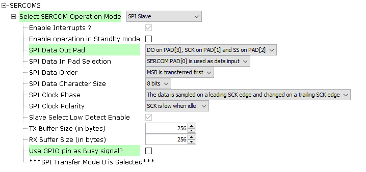
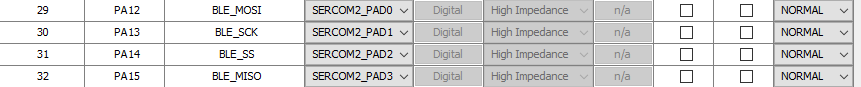

# Configuración de SPI (Modo Esclavo)

El AVM utiliza **SPI en modo esclavo** para comunicarse con el NRF52830.  
Esta guía describe cómo configurar el SPI slave.

---

## 1. Agregar el SERCOMx

Para agregar el periférico SERCOMx, consulta la guía:  
[Configuración de I2C (SERCOM)](./I2C.md)

---

## 2. Configuración del SERCOMx como SPI Slave

En las opciones de configuración del SERCOMx, selecciona el modo **SPI Slave**:

<div align="center">
	
</div>

> ⚙️ **Nota:** Las configuraciones específicas dependerán del periférico y la aplicación.

---

## 3. Configuración de Pines

Configura los pines correspondientes en el *Pin Configurator*:

<div align="center">
	
</div>

> 🔔 **Asegúrate de que el periférico tenga un reloj (clk) asignado.**

---

## 4. Funciones Disponibles

Al generar el código, estarán disponibles funciones en:

```
src/config/default/peripheral/sercom/spi_slave/plib_sercom2_spi_slave.h
```

---

## 5. Ejemplo de Uso en main.c

En el archivo [main](../src/main.c) de ejemplo se encuentra la inicialización y el callback:

```c
// Callback para cuando se completa una transacción SPI
void SPI_SlaveCallback(uintptr_t context)
{
    // Verificar si hay errores primero
    SPI_SLAVE_ERROR error = SERCOM2_SPI_ErrorGet();
    if (error != SPI_SLAVE_ERROR_NONE)
    {
        return;
    }
    
    // Obtener cuántos bytes fueron recibidos
    lastBytesReceived = SERCOM2_SPI_ReadCountGet();
    
    if (lastBytesReceived > 0)
    {
        // Leer los datos recibidos
        size_t bytesRead = SERCOM2_SPI_Read(spiRxBuffer, sizeof(spiRxBuffer));
        
        if (bytesRead > 0 && spiRxBuffer[0] != 0x00)
        {
            lastCommand = spiRxBuffer[0];
            spiCommandReceived = true;
        }
    }
}

// En main():
void main(){
    // ...código...

    // Inicializar SPI Slave
    SERCOM2_SPI_Initialize();
    SERCOM2_SPI_CallbackRegister(SPI_SlaveCallback, 0);
    
    // Inicializar sistema BLE slave
    BLE_slave_init();
    
    // ...más...
}
```

---

## 6. Procesamiento de Comandos SPI

Además, se incluyen los archivos [ble_slave.c](../src/ble_slave.c) y [AVM_ble_cmd.c](../src/AVM_ble_cmd.c) para procesar los comandos como en el AVM.

El main los llama así:

```c
// Función para procesar comandos SPI recibidos
void ProcessSPICommands(void)
{
    if (spiCommandReceived)
    {
        // Usar el nuevo sistema BLE para procesar comandos
        BLE_processCommand(lastCommand, spiRxBuffer, lastBytesReceived);
        
        // Resetear flag
        spiCommandReceived = false;
    }
}
```

---

[⬅️ Volver al README](./../README.md)