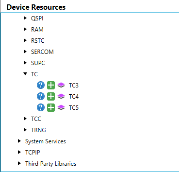
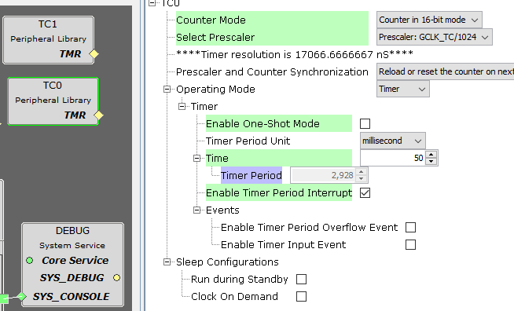
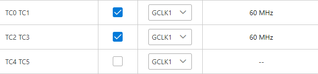

# Configuración de Timers (TC)

## 1. Agregar un Timer

Para agregar un timer, incorpora su bloque correspondiente desde el **Project Graph**.  
En la ventana **Device Resources** aparece el periférico **TC** en:

```
Libraries → Harmony → Peripherals → TC
```

<div align="center">
	
</div>

---

## 2. Configuración del Timer

El **TC** agregado aparecerá en la ventana principal del *Project Graph*.  
Al hacer clic sobre él, se mostrarán sus opciones en **Configurator Options**:

<div align="center">
	
</div>

- **Modo de conteo**
- **Prescaler**: divide uno de los **GLCK** configurados desde el *Clock Configurator*.

Para editar el reloj, accede al plugin mencionado y en la opción **Peripheral Clock Configurator**, busca el TC a cambiar:

<div align="center">
	
</div>

---

## 3. Configuración del Periodo e Interrupciones

- Configura el **periodo del timer** (en unidades temporales).
- Activa las **interrupciones** si lo necesitas.

---

## 4. Uso en el Código

> ⚡ **Ejemplo:** Iniciar el timer y registrar el callback de interrupción.

```c
void TC1_CH0_TimerInterruptHandler(uint32_t status, uintptr_t context)
{
    LED_B_Toggle();
}

// ...
int main ( void )
{
    // Initialize all modules
    SYS_Initialize(NULL);

    // [mucho código de inicialización]

    // Registrar función callback para la interrupción de periodo de TC1 CH0
    TC1_TimerCallbackRegister(TC1_CH0_TimerInterruptHandler, (uintptr_t)NULL);

    // Iniciar el timer TC1
    TC1_TimerStart();
}
```

- Se registra el **callback**.
- Se inicia el **timer**.

---

[⬅️ Volver al README](./../README.md)