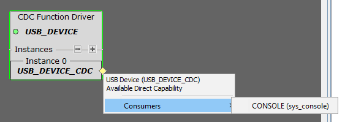
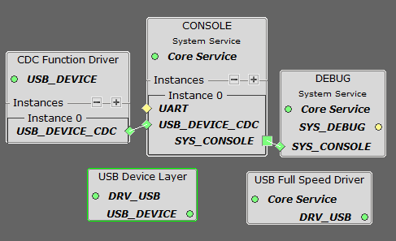

# Comunicación Serial por USB (CDC)

Para usar el **serial por USB**, sigue el paso 3 del siguiente tutorial oficial de Microchip:

🔗 [USB Getting Started Training Module - Step 2](https://developerhelp.microchip.com/xwiki/bin/view/software-tools/harmony/usb-getting-started-training-module/usb-getting-started-training-module-step-2/)

---

## 1. Agregar el recurso CDC

En **Resource Management [MCC]** busca:

```
Device Resources → Libraries → Harmony → USB → Device Stack → CDC Function Driver
```

Configura el CDC como indica el tutorial.

---

## 2. Asignar reloj de 48 MHz

> ⚠️ **Importante:**  
> Es primordial asignar un **clk de 48 MHz** al periférico USB.

---

## 3. Consola para impresión

Una forma sencilla de usar `print` es asignar una consola como *satisfacer*, como muestra la imagen:

<div align="center">
    
</div>

---

## 4. Componentes necesarios

Para que funcione correctamente, asegúrate de tener las siguientes **5 configuraciones**:

<div align="center">
    
</div>

---

## 5. Configuración de USB Device Layer

La **USB device layer** debe tener las siguientes configuraciones:

<div align="center">
    
</div>

---

## 6. Prueba de funcionamiento

Con estas configuraciones, al generar código y cargar el firmware, el PC debería detectar el **puerto COM** automáticamente.

---

## 7. Imprimir por consola

Ya puedes imprimir usando:

```c
SYS_CONSOLE_PRINT(fmt, ...) 
```

Funciona igual que el `printf` estándar.

> ℹ️ **Nota:** No he probado usar `SYS_CONSOLE_READ_FPTR`.

---

[⬅️ Volver al README](./../README.md)